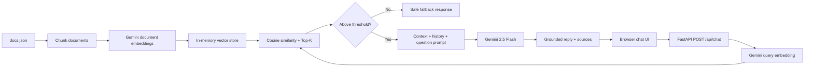
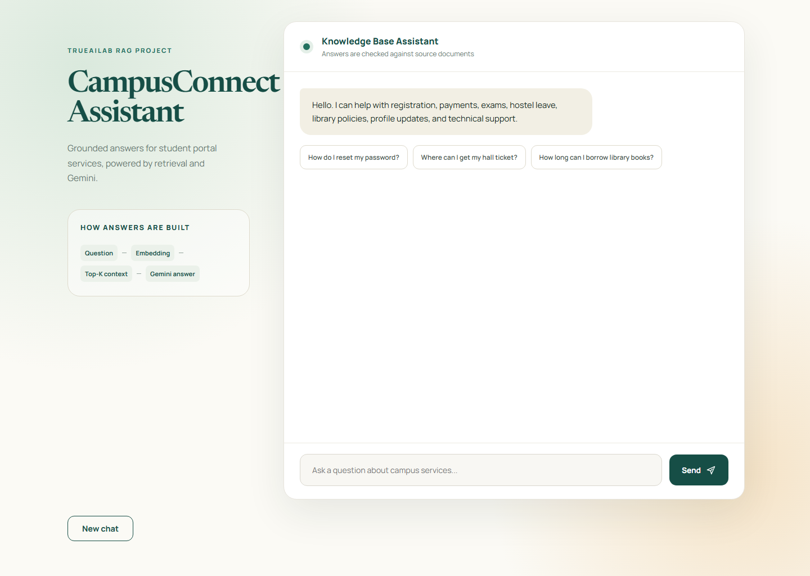
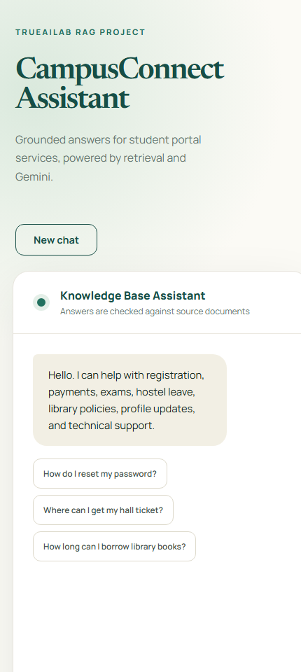
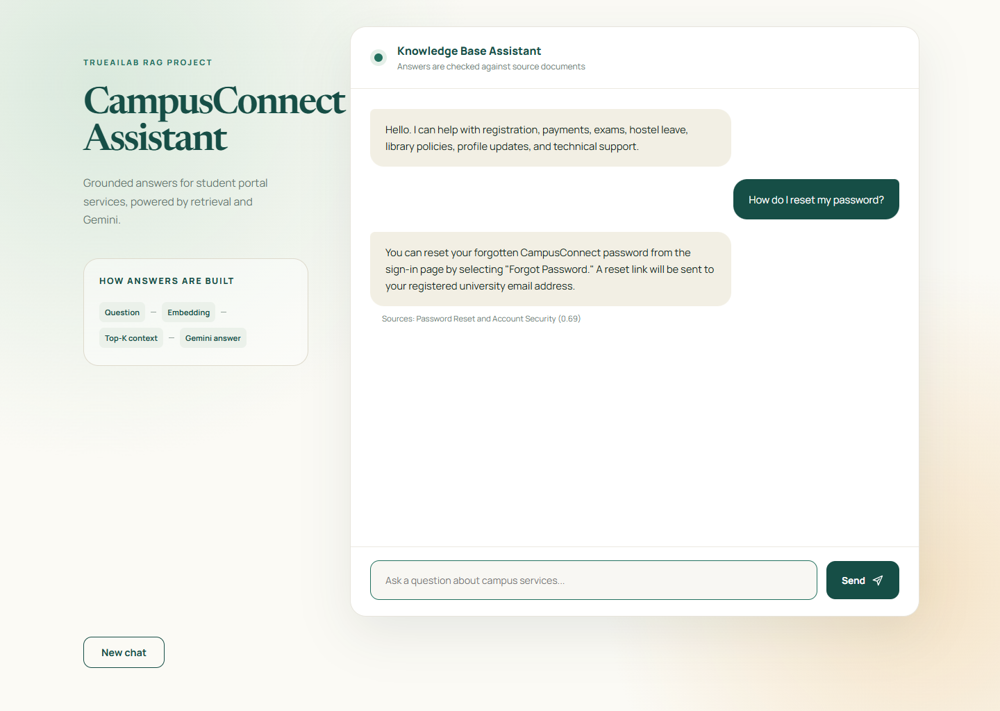
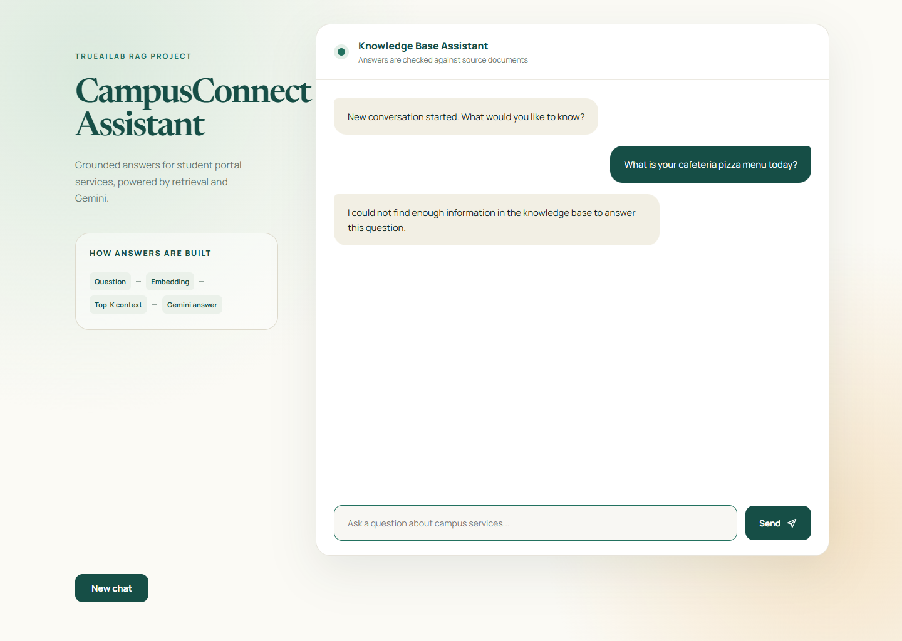

# CampusConnect GenAI Assistant with RAG

A production-style student support chat assistant built for the TRUEAILAB
assignment. It answers only from a custom campus-services knowledge base by
retrieving semantically relevant document chunks before requesting a grounded
answer from Gemini.

## Features

- FastAPI backend with `POST /api/chat` and `GET /health`
- Basic responsive HTML/CSS/JavaScript frontend served by the backend
- Eight-document JSON knowledge base with chunk metadata
- Real Gemini embeddings and cosine-similarity vector retrieval
- Top-3 retrieval and configurable similarity threshold
- Gemini LLM generation only after sufficient context is retrieved
- Four-pair per-session conversation history
- Friendly welcome handling for greetings without inventing knowledge-base facts
- Token usage return when the Gemini response provides usage metadata
- Structured validation/provider errors, explicit request timeouts, and
  retrieval/token-usage logging

## Architecture Diagram



## RAG Workflow

1. At the first chat request, the application loads `docs.json`, splits document
   content into chunks, and generates document embeddings.
2. Each chunk is stored in memory with its title, chunk ID, source document, and
   vector.
3. For each user message, Gemini produces a question embedding.
4. The application calculates cosine similarity against stored vectors, logs the
   scores, and retains the top three results.
5. If no result passes the threshold, the application replies with a safe
   knowledge-base fallback and does not invoke the chat model.
6. Otherwise, retrieved context, recent session history, and the current
   question are sent to Gemini for a grounded answer.

## Embedding Strategy

The app uses the current `google-genai` Python SDK and
`gemini-embedding-001`. During indexing, chunks are embedded with the
`RETRIEVAL_DOCUMENT` task type. Questions are embedded with the
`RETRIEVAL_QUERY` task type, matching Google's document-search task pairing.
Both produce 768-dimensional vectors to keep
the in-memory store small while retaining semantic retrieval quality.

Chunking uses blocks of at most 320 words, which is suitable for the recommended
300-500 token chunk range for this small support knowledge base. Every stored
chunk records:

- Document title
- Chunk ID such as `doc-1-chunk-1`
- Source document (`docs.json`)
- Original text and embedding vector

## Similarity Search Logic

Retrieval uses cosine similarity:

```text
cosine_similarity(query, chunk) =
    dot(query, chunk) / (norm(query) * norm(chunk))
```

Results are sorted in descending order and the top `TOP_K=3` are considered.
Only chunks scoring at least `SIMILARITY_THRESHOLD=0.65` are passed into the
prompt. The value is configurable in `.env` so it can be tuned after observing
scores for the chosen documents and test questions.

Simple greetings and new-student introductions are answered with a non-factual
welcome message and supported-topic menu. Questions that request information
still go through embedding retrieval and grounding before an answer is produced.

## Prompt Design

The prompt explicitly states that retrieved context is the only factual source.
Conversation history is included only to interpret follow-up wording. This
prevents a prior unsupported statement from overriding knowledge-base content.
The generation temperature is `0.2`, producing consistent factual responses.
Gemini requests have a configurable 30-second timeout; invalid keys, rate
limits, and timeouts return structured API errors.

## Project Structure

```text
.
|-- app/
|   |-- main.py
|   |-- config.py
|   |-- models/schemas.py
|   |-- prompts/rag_prompt.py
|   |-- services/
|   |   |-- gemini.py
|   |   |-- history.py
|   |   `-- rag.py
|   `-- vectorstore/memory_store.py
|-- frontend/
|   |-- index.html
|   |-- styles.css
|   `-- app.js
|-- screenshots/
|   |-- chat-interface.png
|   |-- chat-interface-mobile.png
|   |-- grounded-answer.png
|   `-- fallback-answer.png
|-- tests/
|   |-- test_api.py
|   `-- test_rag.py
|-- docs.json
|-- .env.example
|-- requirements.txt
`-- render.yaml
```

## Local Setup

Prerequisites: Python 3.10+ and a Gemini API key from Google AI Studio.

```bash
python -m venv .venv
```

On Windows PowerShell:

```powershell
.\.venv\Scripts\Activate.ps1
pip install -r requirements.txt
Copy-Item .env.example .env
```

Open `.env` and set:

```dotenv
GEMINI_API_KEY=your_real_api_key
```

The same Gemini key authorizes both embedding and generation requests, so a
separate embedding key is not required for this provider.

Run the app:

```powershell
uvicorn app.main:app --reload
```

Open `http://127.0.0.1:8000` in a browser. Never commit `.env` or an API key.

## API Examples

Health check:

```bash
curl http://127.0.0.1:8000/health
```

Chat request:

```bash
curl -X POST http://127.0.0.1:8000/api/chat \
  -H "Content-Type: application/json" \
  -d "{\"sessionId\":\"demo-1\",\"message\":\"How do I reset my password?\"}"
```

Example response:

```json
{
  "reply": "Select Forgot Password on the sign-in page to receive a reset link.",
  "tokensUsed": 105,
  "retrievedChunks": 1,
  "sources": [
    {
      "title": "Password Reset and Account Security",
      "chunkId": "doc-1-chunk-1",
      "score": 0.82
    }
  ]
}
```

## Testing

```powershell
pytest
```

The tests check threshold fallback behavior, verify that retrieval context is
included before LLM generation, validate cosine similarity behavior, and
exercise API health and invalid-request errors.

Manual test questions:

| Question | Expected behavior |
| --- | --- |
| How do I reset my password? | Answer from password document |
| Where can I download a hall ticket? | Answer from exam document |
| What is the refund policy? | Safe fallback response |

## Deployment on Render

1. Push this project to a public GitHub repository.
2. In Render, create a new Blueprint deployment and connect the repository.
3. Render detects `render.yaml`.
4. Add `GEMINI_API_KEY` as a secret environment variable in the Render dashboard.
5. Deploy and open the generated public web-service URL.
6. Test `/health` and a supported chat question after deployment.

The Gemini API key remains on the server; the frontend never receives it.

## Screenshots

Desktop interface:



Responsive mobile interface:



Grounded answer retrieved from the password knowledge-base document:



Safe fallback when the question is outside the knowledge base:



## Submission

```text
GitHub Repository:
https://github.com/SolomonPinto/campusconnect-rag-assistant

Live Application:
https://campusconnect-rag-assistant.onrender.com
```

## Gemini References

- [Google Gen AI SDK quickstart](https://ai.google.dev/gemini-api/docs/quickstart)
- [Gemini embeddings documentation](https://ai.google.dev/gemini-api/docs/embeddings)
- [Gemini model documentation](https://ai.google.dev/gemini-api/docs/models)
